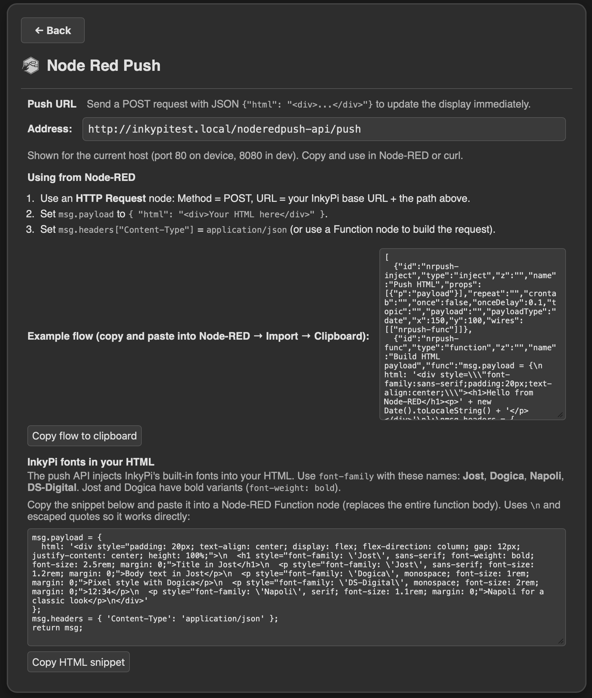

# InkyPi-Plugin-nodeRedPush


*InkyPi-Plugin-nodeRedPush* is a plugin for [InkyPi](https://github.com/fatihak/InkyPi) that lets you push HTML content to the e-ink display from **any program**: Node-RED, scripts, cron jobs, Home Assistant, or any HTTP client. Send a POST request with a JSON body `{"html": "<div>...</div>"}` and the display updates immediately with the rendered content.

**What it does:**

- **Push API** — Exposes a POST endpoint (`/noderedpush-api/push`) that accepts JSON `{"html": "<div>...</div>"}` and renders it to the display.
- **Use from any program** — Call the push URL from curl, Python, shell scripts, cron, or other automation. No Node-RED required (see example below).
- **Node-RED integration** — Use an HTTP Request node to send HTML from your flows. The settings page includes a ready-to-import example flow.
- **HTML rendering** — Your HTML is rendered to an image (same engine as other InkyPi plugins) and pushed to the display. Supports inline styles, responsive layout, and **InkyPi’s built-in fonts** (Jost, Dogica, Napoli, DS-Digital).


The plugin requires **blueprint registration** in InkyPi core. On first open of the settings page, if core is not yet patched, the plugin will apply the patch automatically and restart the service. It's the same patch as the [Plugin Manager](https://github.com/RobinWts/InkyPi-Plugin-PluginManager) plugin, see [CORE_CHANGES.md](https://github.com/RobinWts/InkyPi-Plugin-PluginManager/blob/main/pluginmanager/CORE_CHANGES.md) for more information.

**Requirements:**

- InkyPi with blueprint registration (plugin applies the patch automatically if missing).
- Node-RED or any HTTP client to POST JSON to the push URL.
- No additional Python dependencies.

---

**Settings:**



- **Push URL** — The API path (e.g. `/noderedpush-api/push`). Full URL = your InkyPi base URL + API path. On the device InkyPi listens on port **80** (e.g. `http://192.168.1.10/noderedpush-api/push`); in dev mode it uses port **8080**.
- **Using from Node-RED** — Short instructions: use an HTTP Request node (POST, JSON body), set `msg.payload = { "html": "<div>...</div>" }` and `msg.headers["Content-Type"] = "application/json"`.
- **Example flow** — Copy-paste JSON for a minimal Node-RED flow (Inject → Function → HTTP Request → Debug). Import via Node-RED → Import → Clipboard, then set the HTTP Request URL to your InkyPi host.
- **InkyPi fonts** — The push API injects InkyPi’s built-in fonts into your HTML. Use `font-family: "Jost"`, `"Dogica"`, `"Napoli"`, or `"DS-Digital"` in your CSS. Jost and Dogica support `font-weight: bold`. A copy-paste HTML snippet in the settings shows an example using all four fonts.

---

## Push from other programs

You can update the display from any tool that can send HTTP POST requests. Replace `YOUR_INKYPI_HOST` with your device’s IP or hostname (e.g. `192.168.1.10` or `inkypi.local`). On the device InkyPi uses port **80**; in dev mode use port **8080**.

**Example with curl:**

```bash
curl -X POST -H "Content-Type: application/json" \
  -d '{"html":"<div style=\"padding:20px;text-align:center;font-family:sans-serif;\"><h1>Hello</h1><p>From curl</p></div>"}' \
  http://YOUR_INKYPI_HOST/noderedpush-api/push
```

Use the same URL and JSON body from Python (`requests.post(...)`), shell scripts, cron, or Home Assistant REST commands.

---

## Installation

### Install

Install the plugin using the InkyPi CLI with the plugin ID and repository URL:

```bash
inkypi plugin install noderedpush https://github.com/RobinWts/InkyPi-Plugin-NodeRedPush
```

Or install the [Plugin Manager](https://github.com/RobinWts/InkyPi-Plugin-PluginManager) first and install this plugin via the Web UI.

Open the plugin settings page to apply the blueprint registration patch if needed.

Then use the push API from any program (see [Push from other programs](#push-from-other-programs) above).

---

## Development status

Work in progress.

---

## License

This project is licensed under the GNU General Public License.
